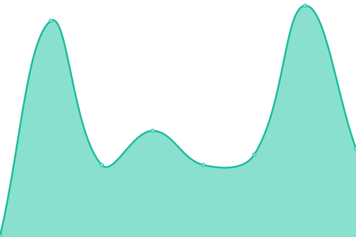

# [📈 Live Status](https://upptime.github.io/upptime): <!--live status--> **🟩 All systems operational**

This repository contains the open-source uptime monitor and status page for [Upptime](https://upptime.js.org), powered by [Upptime](https://github.com/upptime/upptime).

With [Upptime](https://upptime.js.org), you can get your own unlimited and free uptime monitor and status page, powered entirely by a GitHub repository. We use [Issues](https://github.com/upptime/upptime/issues) as incident reports, [Actions](https://github.com/itpaspire-ship-it/upptime/actions) as uptime monitors, and [Pages](https://upptime.github.io/upptime) for the status page.

<!--start: status pages-->
<!-- This summary is generated by Upptime (https://github.com/upptime/upptime) -->
<!-- Do not edit this manually, your changes will be overwritten -->
<!-- prettier-ignore -->
| URL | Status | History | Response Time | Uptime |
| --- | ------ | ------- | ------------- | ------ |
|  [Google](https://www.google.com) | 🟩 Up | [google.yml](https://github.com/itpaspire-ship-it/upptime/commits/HEAD/history/google.yml) | 

 98ms
     
 | 

<a href="https://itpaspire-ship-it.github.io/upptime/history/google">100.00%</a>
    

|  [Wikipedia](https://en.wikipedia.org) | 🟩 Up | [wikipedia.yml](https://github.com/itpaspire-ship-it/upptime/commits/HEAD/history/wikipedia.yml) | 

 105ms
     
 | 

<a href="https://itpaspire-ship-it.github.io/upptime/history/wikipedia">100.00%</a>
    

|  [Hacker News](https://news.ycombinator.com) | 🟩 Up | [hacker-news.yml](https://github.com/itpaspire-ship-it/upptime/commits/HEAD/history/hacker-news.yml) | 

 372ms
     
 | 

<a href="https://itpaspire-ship-it.github.io/upptime/history/hacker-news">100.00%</a>
    

|  [Fsmone](https://fsmone.com) | 🟩 Up | [fsmone.yml](https://github.com/itpaspire-ship-it/upptime/commits/HEAD/history/fsmone.yml) | 

 952ms
     
 | 

<a href="https://itpaspire-ship-it.github.io/upptime/history/fsmone">100.00%</a>
    

|  [bondsupermart](https://www.bondsupermart.com) | 🟩 Up | [bondsupermart.yml](https://github.com/itpaspire-ship-it/upptime/commits/HEAD/history/bondsupermart.yml) | 

 1039ms
     
 | 

<a href="https://itpaspire-ship-it.github.io/upptime/history/bondsupermart">100.00%</a>
    

|  [bondsupermart API](https://service.bondsupermart.com/service) | 🟩 Up | [bondsupermart-api.yml](https://github.com/itpaspire-ship-it/upptime/commits/HEAD/history/bondsupermart-api.yml) | 

 736ms
     
 | 

<a href="https://itpaspire-ship-it.github.io/upptime/history/bondsupermart-api">100.00%</a>
    

|  [bondsupermart API 2](https://service.ifastbond.com/service) | 🟩 Up | [bondsupermart-api-2.yml](https://github.com/itpaspire-ship-it/upptime/commits/HEAD/history/bondsupermart-api-2.yml) | 

 1072ms
     
 | 

<a href="https://itpaspire-ship-it.github.io/upptime/history/bondsupermart-api-2">100.00%</a>
    

|  [infinityfa](https://www.infinityfa.com.sg/Ecosystem/account/login) | 🟩 Up | [infinityfa.yml](https://github.com/itpaspire-ship-it/upptime/commits/HEAD/history/infinityfa.yml) | 

 984ms
     
 | 

<a href="https://itpaspire-ship-it.github.io/upptime/history/infinityfa">100.00%</a>
    

|  [infinityfa admin](https://admin.infinityfa.com.sg) | 🟩 Up | [infinityfa-admin.yml](https://github.com/itpaspire-ship-it/upptime/commits/HEAD/history/infinityfa-admin.yml) | 

 1435ms
     
 | 

<a href="https://itpaspire-ship-it.github.io/upptime/history/infinityfa-admin">100.00%</a>
    

<!--end: status pages-->

[**Visit our status website →**](https://upptime.github.io/upptime)

## 📄 License

- Powered by: [Upptime](https://github.com/upptime/upptime)
- Code: [MIT](./LICENSE) © [Anand Chowdhary](https://anandchowdhary.com), supported by [Pabio](https://pabio.com)
- Data in the `./history` directory: [Open Database License](https://opendatacommons.org/licenses/odbl/1-0/)
